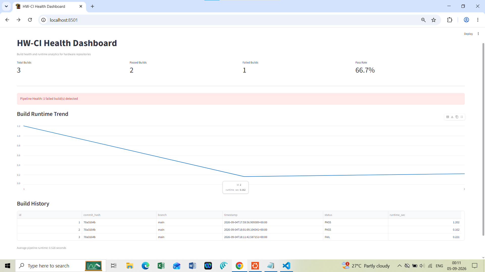

# HW-CI Health Platform

A Python-based CI/CD and analytics platform for multi-IP ASIC/SoC hardware repositories. It automatically runs RTL quality checks, records build history and runtime metrics, and provides a Streamlit dashboard for build health analysis.

## Dashboard

The Streamlit dashboard provides build health, pass/fail statistics, runtime trends, and build history.



## Overview

This MVP demonstrates a hardware-focused CI pipeline using open-source EDA tools:

```text
Git Commit
    │
    ▼
┌──────────┐
│   Lint   │  Verilator
└────┬─────┘
     ▼
┌──────────┐
│ Synthesis│  Yosys
└────┬─────┘
     ▼
┌──────────┐
│Simulation│  Icarus Verilog
└────┬─────┘
     ▼
┌──────────┐
│  SQLite  │  Build history
└────┬─────┘
     ▼
┌──────────────┐
│  Streamlit   │
│  Dashboard   │
└──────────────┘
```

## Features

* Automated RTL linting with Verilator
* RTL synthesis checks with Yosys
* RTL simulation with Icarus Verilog
* Git branch and commit traceability
* SQLite-based build and stage history
* Pipeline runtime and failure analytics
* Streamlit build-health dashboard
* Quality-gate ready architecture
* Designed for multiple hardware/IP repositories

## Technology Stack

| Component       | Technology            |
| --------------- | --------------------- |
| Language        | Python                |
| Version Control | Git                   |
| Lint            | Verilator             |
| Synthesis       | Yosys                 |
| Simulation      | Icarus Verilog        |
| Database        | SQLite                |
| Analytics       | Python                |
| Dashboard       | Streamlit + Pandas    |
| Test Repository | Asynchronous FIFO RTL |

## Quick Start

Clone the project:

```bash
git clone https://github.com/YOUR_USERNAME/hw-ci-platform.git
cd hw-ci-platform
```

Create a Python environment:

```bash
python3 -m venv .venv
source .venv/bin/activate
pip install streamlit pandas
```

Initialize the database:

```bash
sqlite3 db/build.db < db/schema.sql
```

The platform expects a hardware repository separately. For the MVP testbench:

```bash
git clone https://github.com/SarangKudtarkar/RTL2GDS-Asynchronous-FIFO.git input-repo
```

Run the complete pipeline:

```bash
python3 flow/pipeline.py \
    ../input-repo/async_fifo.v \
    ../input-repo/async_fifo_tb.v \
    async_fifo \
    ../input-repo
```

Run analytics:

```bash
python3 analysis/analytics.py
```

Launch the dashboard:

```bash
streamlit run dashboard/app.py
```

## Pipeline

Each build records:

* Git branch
* Git commit SHA
* Overall PASS/FAIL status
* Total runtime
* Individual stage status
* Individual stage runtime

The pipeline stops when a quality stage fails, preventing later stages from running unnecessarily.

## Dashboard

The Streamlit dashboard provides:

* Total builds
* Passed/failed builds
* Pass rate
* Pipeline health
* Runtime trend
* Build history
* Commit traceability
* Average pipeline runtime

## Repository Structure

```text
hw-ci-platform/
├── analysis/
│   └── analytics.py
├── dashboard/
│   └── app.py
├── db/
│   ├── build.db
│   ├── database.py
│   └── schema.sql
├── flow/
│   ├── lint.py
│   ├── synth.py
│   ├── simulate.py
│   └── pipeline.py
├── vcs/
├── farm/
├── config/
├── logs/
├── results/
├── .gitignore
└── README.md
```

The hardware repository is kept separately from the platform so the same CI framework can analyze different IP/RTL repositories.

## Concepts Demonstrated

**CI/CD:** Automatically validate hardware changes on every commit.

**Quality Gates:** A failed lint or synthesis stage prevents later stages from executing.

**Traceability:** Every build is associated with a Git branch and commit.

**Build Analytics:** Historical runtime and failure data can be analyzed to identify regressions.

**Multi-IP Architecture:** The platform is designed to run the same flow against multiple hardware repositories.

## Future Enhancements

* Parallel multi-IP job scheduling
* Formal equivalence checking with EQY/SymbiYosys
* OpenLane RTL-to-GDS flow
* Git pre-push quality gates
* Slack notifications
* Release-readiness metrics
* Runtime regression detection
* Multi-IP dashboard filtering
* Distributed build workers

## Project Goal

The goal is to demonstrate how software-style CI/CD practices can be applied to ASIC/SoC development, providing automated validation, build traceability, quality gates, and engineering analytics across hardware IP repositories.
